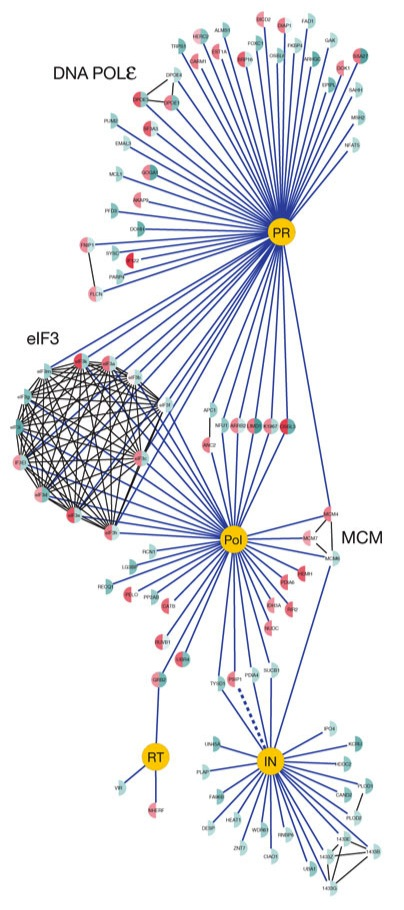
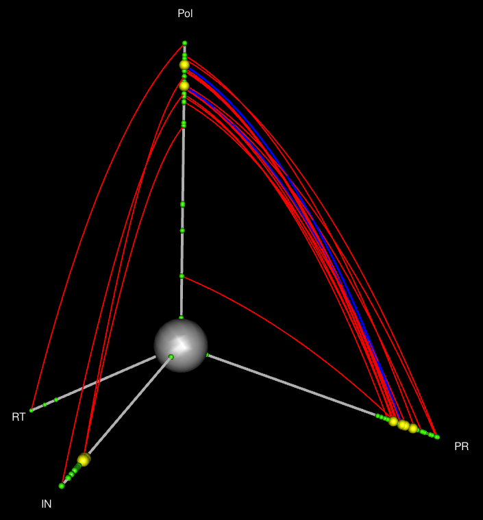
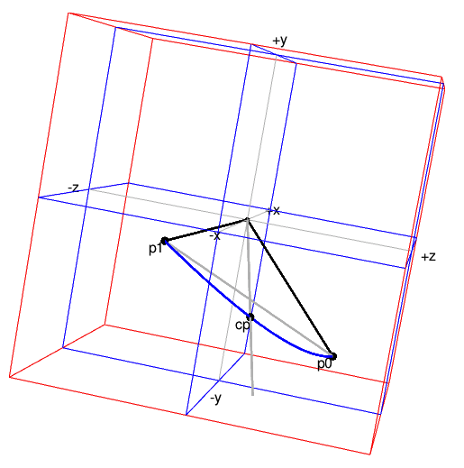

```{r SetUp, echo = FALSE, eval = TRUE}
rm(list = ls())

suppressPackageStartupMessages(library("HiveR"))
suppressPackageStartupMessages(library("grid"))
suppressPackageStartupMessages(library("FuncMap"))
suppressPackageStartupMessages(library("sna"))
suppressPackageStartupMessages(library("xtable"))
suppressPackageStartupMessages(library("knitr"))
suppressPackageStartupMessages(library("bipartite"))

desc <- packageDescription("HiveR")
vers <- paste("version", desc$Version)

set.seed(123)
# use pdfcrop if it exists
if (Sys.which("pdfcrop") != "") knit_hooks$set(crop = hook_pdfcrop)
opts_chunk$set(echo = FALSE, fig.path = "./graphics/")
```

This document describes some features of the `HiveR` package.  The current release contains a core set of functions for creating and drawing hive plots.^[[Github](http://github.com/bryanhanson/HiveR) or [CRAN](http://CRAN.R-project.org/package=HiveR)] There may well be bugs and features that can be improved -- your comments are always welcome.^[Contact info and issue tracking can be found at the web sites above.] In fact, user input has regularly improved and extended `HiveR`.

As with any `R` package, details on functions discussed below can be found by typing `?function_name` in the `R` console after installing `HiveR`.  A complete list of functions available can be seen by typing `?HiveR` and then at the bottom of the page that opens, click on the index link.  Many of the help pages contain extensive examples of common tasks.

# Background, Inspiration and Motivation

`HiveR` was inspired by the concept of hive plots as developed by Martin Krzywinski at the Genome Sciences Center ([www.hiveplot.com](http://www.hiveplot.com/)).  Hive plots are a reaction to "hairball" style networks in which the layout of the network is arbitrary and hypersensitive to even small changes in the underlying network.  Hive plots are particularly well-suited for comparing networks, as well as for the discovery of emergent properties of networks.

The key innovation in a hive plot, compared to other means of graphically displaying network structure, is how node information is handled.  In a hive plot, there is a node coordinate system consisting of two parts.  First, nodes are assigned to axes based upon qualitative or quantitative characteristics of the the node, for instance membership in a certain category.  As will be discussed later, this assignment process is key to constructing a hive plot.  Second, the position of the node along the axis, the radius, is based upon some quantitative characteristic of the node.  Edges are handled in a fairly standard way, but may be colored or have a width or weight which encodes an interesting value.

In creating a hive plot, one maps network parameters to the plot, and thus the process can be readily tuned to meet one's needs.  The mappable parameters are listed in Table \ref{Mapping}, and the mapping is limited only by one's creativity and the particular knowledge domain.  Thus ecologists have their own measures of food webs, social network analysts have various measures describing interconnectedness etc.  An essential point is that mapping network parameters in this way results in a reproducible plot.

Krzywinski has an excellent paper detailing the features and virtues of hive plots and is a must-read.\cite{Krzywinski2011}  He notes the following virtues of hive plots:

* Hive plots are rational in that only the structural properties of the network determine the layout.
* Hive plots are flexible and can be tuned to show interesting features.
* Hive plots are predictable since they arise from rules that map network features to plot features.
* Hive plots are robust to changes in the underlying network.
* Hive plots of different networks can be compared.
* Hive plots are transparent and practical.
* Plots of networks are generally complex and require some investment to understand.  Complexity plots well in a hive plot and details can be inspected.

\begin{table}
\begin{center}
\begin{tabular}{|l|}
\hline
\emph{mappable hive plot parameters}\\
\hline
\hline
Axis to which a node is assigned\\
Radius of a node\\
Color of a node\\
Size of a node\\
\hline
Color of an edge\\
Width or weight of an edge\\
\hline
\end{tabular}
\end{center}
\caption{Hive plot features that can be mapped to network parameters.\label{Mapping}}
\end{table}

Inspired by the examples given by Kryzwinski in his materials on the web, I created the `R` package  `FuncMap` in December 2010.\cite{Hanson2011}  This single function package maps the function calls made by an `R` package into 3 types: sources, which are functions that make only outgoing calls, sinks, which take only incoming calls, and managers, which do both.

`HiveR` takes things quite a bit further.  `HiveR` is a fresh implementation of hive plots in `R`, not a port of the original `Perl` version.  As such, it does some things differently, and not all features are implemented (and they may or may not be in the future).  `HiveR` will draw 2D hive plots with 2-6 axes in a style close to the original.  However, `HiveR` adds value by making 3D, interactive plots possible when there are 4-6 axes.  These 3D plots were inspired by the ideas of VSEPR theory in chemistry:  the axes of these 3D plots are  arranged with tetrahedral, trigonal bipyramidal or octahedral geometries for 4-6 axes respectively (see Figure \ref{VSEPR} and [wikipedia/VSEPR](https://secure.wikimedia.org/wikipedia/en/wiki/Vsepr)).  The specifics of 3D hive plots will be discussed in a later section.


# HiveR Features

## Internal Representation of Hive Data

`HiveR` stores the information needed to create a hive plot in a `HivePlotData` object which is an S3 class.  As an S3 class, this structure can be easily extended by the user to store additional information (though using that information as part of a hive plot would require more work).  Utilities are provided to summarize, troubleshoot and check the integrity of these objects (functions `sumHPD` and `chkHPD` respectively).  The structure and content of a `HivePlotData` object is shown in Table \ref{Struc}.

\begin{small}
\begin{table}
\begin{center}
\begin{xtabular}{| p{0.15\textwidth} p{0.2\textwidth} | p{0.15\textwidth} | p{0.35\textwidth} |}

\hline
\$nodes & &  & \\
& \$id & int & identifier \\
& \$lab & chr & label \\
& \$axis & int & axis  \\
& \$radius & num & radius \\
& \$size & num & size \\
& \$color & chr & color \\
\hline
\$edges & &  &  \\
& \$id1 & int & 1st node id \\
& \$id2 & int & 2nd node id \\
& \$weight & num & width \\
& \$color & chr & color \\
\hline
\$type & & chr & 2D or 3D plot \\
\hline
\$desc & & chr & description \\
\hline
\$axis.cols & & chr & axis colors \\
\hline
- attr & & chr & "HivePlotData" \\
\hline

\end{xtabular}
\end{center}
\caption{The structure of a HivePlotData object.\label{Struc}}
\end{table}
\end{small}

## Generation of Random Network Data Sets

`HiveR` has the ability to generate random network data sets using function `ranHiveData`.  These are primarily useful for testing and demonstrations.  A data set has a type, either 2D or 3D.  Type 2D may have 2-6 axes and is plotted in a 2D window using `grid` graphics which are extremely fast.  Type 3D applies to 4-6 axes only and these hive plots are drawn in 3D using `rgl` and are interactive.  When using `ranHiveData` you can specify which type you desire.

## Built-in Data Sets

`HiveR` contains two related 2D type data sets, `Safari` and `Arroyo`.  These are plant-pollinator data sets which give the number of visits for each plant-pollinator pair.  Data for the *E. coli* gene regulatory network is also included; it is derived from the RegulonDB.\cite{Gama2010} Each of these data sets are used in the examples below.  Finally, there is a data set called `HEC` which is derived from the hair and eye color data set.

## Importing Real Data Sets

There are three functions for importing data into `HiveR`: `dot2HPD`, `adj2HPD` and `edge2HPD`.

The function `dot2HPD` will import files in .dot format and convert them to `HivePlotData` objects (see [wikipedia/DOT_language](https://secure.wikimedia.org/wikipedia/en/wiki/DOT_language)).  This is done with the aid of two external files.  One contains information about how to map node labels to `HivePlotData` properties.  The other contains information about mapping edge properties.  This approach gives one a lot of flexibility to process the same graph into various hive plots.  This process is demonstrated later for the *E. coli* data set.  Currently, only a very small set of the .dot standard is implemented and one should not expect any particular .dot file to process correctly.

The function `adj2HPD` will import an adjacency matrix, and `edge2HPD` will import an edge list.  For these functions the initially created `HivePlotData` object will almost certainly need a fair amount of manipulation before it can be plotted.

## Modifying `HivePlotData` Sets

Function `mineHPD` has several options for extracting information from within an existing `HivePlotData` object and converting it to a modifed `HivePlotData` object.  Additional options are readily incorporated.  For the current selection, check the help page (`?mineHPD`). This function will be used extensively in the examples that follow.  In addition, function `manipAxis` can also be used to modify a `HivePlotData` object by scaling or inverting axes.  This can be done on the fly (as the plot is created) or the `HivePlotData` object can be permanently modified.

## Making Hive Plots

In a hive plot, because the position of the node along an axis (the radius) is quantitative, the nodes can be plotted at their absolute value (native units), normalized to run between 0\ldots1, plotted by rank or by a combination of ranking and norming.  Some aspects of the plot that depend upon these options are shown in Table \ref{Method}.  These different ways of plotting the same data often look dramatically different, and for a particular data set, some methods of plotting may provide more insight.  Functions `plotHive` and `plot3dHive` have an argument `method` which controls node plotting on the fly; function `manipAxis` is used in the background and can also be called independently if desired.

\begin{small}
\begin{table}
\begin{center}
\begin{flushleft}
\begin{xtabular}{| p{0.15\linewidth} | p{0.22\linewidth} | p{0.22\linewidth} | p{0.28\linewidth} |}
\hline
\emph{method} & \emph{axis length} & \emph{center hole (2D)}  & \emph{node behavior} \\
\hline
\hline
native & $f(units)$ & asymmetric & nodes may overlap\\
\hline
ranked & $\propto rank(nodes)$ & circular & nodes evenly spaced \& don't overlap  \\
\hline
normed  & all equal & circular & nodes may overlap\\
\hline
ranked \& normed & all equal & circular & nodes evenly spaced  \& don't overlap \\
\hline
\end{xtabular}
\end{flushleft}
\end{center}
\caption{Comparison of methods for adjusting the radii of nodes during plotting.\label{Method}}
\end{table}
\end{small}

# A Simple Example Using a Plant-Pollinator Network

`HiveR` contains the built-in data sets, `Safari` and `Arroyo` which provide a useful demonstration of `HiveR`.^[Be warned: I am  not an ecologist and these data sets and plots are merely a demonstration of `HiveR`.]  These are plant-pollinator data sets which were derived from Vasquez and Simberloff.\cite{Vazquez2003}  These describe two-trophic level systems that consist of almost exactly the same suite of plants and pollinators.  `Safari` is based upon observations of an undisturbed area, while `Arroyo` is from a nearby location grazed by cattle.  The original data is composed of plant-pollinator pairs and a count of visits during a fixed observation period for each pair.

Figures \ref{fig:PPNA} and \ref{fig:PPN4} show two means of plotting `Safari` using package `bipartite`.^[Actually in this case we are using the data set `Safariland` from package `bipartite`; `Safari` was derived from `Safariland`.]  Figure \ref{fig:PPNA} is a simple diagram giving plant-pollinator visits as a gray-plot heat map (plants are on the vertical axis).  There are two parameters encoded here: the pairings and the number of visits (arguably, the dimensions of the matrix give the number of species involved as well).  Figure \ref{fig:PPN4} displays plants across the bottom and pollinators across the top.  The width of the connecting bands in the middle encodes the number of visits for a given plant-pollinator pair.  The width of the top or bottom panel for a species is the total number of visits in which that species participates.  Thus there are three parameters shown in this figure: the pairings, the total visits for a single species, and visits between a given pair.  This second plot makes it pretty clear that four plant-pollinator pairs have by far the largest number of visits (these are the large gray-filled bands in the middle of the diagram).

```{r PPNdata }
data(Safariland)
```

```{r PPNA, fig.cap = "Safariland data set plotted with function \\texttt{bipartite::visweb}."}
visweb(Safariland)
```


```{r PPN4, fig.cap = "Safariland data set plotted with function \\texttt{bipartite::plotweb}.", fig.width = 5, fig.height = 5}
plotweb(Safariland, text.rot = 90, adj.high = 0, adj.low = 1, y.lim = c(0, 2), labsize = 0.8)
```

Another approach to presenting this network graphically would be to use function `gplot` in the social network analysis package `sna`.  `gplot` is flexible and has many options.  Figure \ref{fig:PPN5} shows one possible display of `Safari`, plotted with `mode = circle`.  In this plot, plant nodes are colored green and insect nodes red.  The width of the edges is proportional to the number of visits between a pair of species.  Figure \ref{fig:PPN6} shows the same data using the Fruchterman-Reingold algorithm, one which shows that there are actually two networks present (and which is not apparent from the the other plots).  Edge width here is the same as before, but because the high traffic node pairs are close to each other, the connecting, wide edge looks a bit odd and is easy to miss (clearly, one could experiment to improve this detail).

```{r PPN5, fig.cap = "Safariland data set plotted with function \\texttt{sna::gplot} (mode = circle).", warning = FALSE, fig.height = 5, fig.width = 5}
gplot(Safariland, gmode = "graph", edge.lwd = 0.05,
	vertex.col = c(rep("green", 9), rep("red", 27)),
	mode = "circle")
```

```{r PPN6, fig.cap = "Safariland data set plotted with function \\texttt{sna::gplot} (mode = Fruchterman-Reingold).", warning = FALSE, fig.height = 5, fig.width = 5}
gplot(Safariland, gmode = "graph", edge.lwd = 0.05,
	vertex.col = c(rep("green", 9), rep("red", 27)))
```

For a network of this size and complexity, any or some combination of these plots would probably be sufficient to answer many questions.  However, we proceed to plot the data as a hive plot to demonstration some of the features of hive plots.  Figure \ref{fig:PPN2} shows `Safari` and `Arroyo` displayed together in a hive panel, which facilitates direct comparison of the two networks.  In these plots, plants are on one axis, and pollinators are on the other.  Each organism was assigned a radius on its axis based by calculating |d'| using function `dfun` in package `bipartite`.  |d'| is an index of specialization; higher values mean the plant or pollinator is more specialized.  Edge weights were assigned proportional to the square roots greater numbers of visits, and the color-coding is comparable for each figure.  Thus both the edge color and the edge weight encode the same information.  It would of course be possible to encode an additional variables by changing either edge color or weight, or node size.  These plots show a rich amount of information not available from the more standard plots and show that the networks are fundamentally different:

* The degree of specialization with each network is different.  This can be seen in the different radii for the nodes in each plot, as well as in the `Arroyo` panel where the plant axis begins at a lower value.
* A greater number of visits (wider, redder edges) occur between more specialized species (nodes at larger radii) in `Safari` than `Arroyo`.
* The huge number of visits encoded in red in `Safari` (the ungrazed site) is missing in `Arroyo`.

```{r PPN2, fig.cap = "Hive Panel comparing Safari with Arroyo.", fig.height = 5, fig.width = 5}
data(Safari)
Safari$nodes$size <- 0.5
data(Arroyo)
Arroyo$nodes$size <- 0.5

vplayout <- function(x, y) viewport(layout.pos.row = x, layout.pos.col = y)
#
grid.newpage()
pushViewport(viewport(layout = grid.layout(2, 1)))
#
pushViewport(vplayout(1, 1)) # upper plot
plotHive(Safari, ch = 0.1, axLabs = c("plants", "pollinators"), axLab.pos = c(0.15, 0.15), rot = c(-90, 90), np = FALSE, axLab.gpar = gpar(fontsize = 16, col = "white"))
grid.text("Safari (undisturbed)", x = 0.5, y = 0.95, default.units = "npc", gp = gpar(fontsize = 20, col = "white"))
popViewport(2)
#
pushViewport(vplayout(2, 1)) # lower plot
plotHive(Arroyo, ch = 0.1, axLabs = c("plants", "pollinators"), axLab.pos = c(0.15, 0.15), rot = c(-90, 90), np = FALSE, axLab.gpar = gpar(fontsize = 16, col = "white"))
grid.text("Arroyo (disturbed)", x = 0.5, y = 0.95, default.units = "npc", gp = gpar(fontsize = 20, col = "white"))
```

# Some Things to Keep in Mind

Now that we have seen a simple hive plot, it's a good time to review some aspects to keep in mind as you wrap your head around the concept and we move to more complicated plots.

Hive plots are radially-arranged parallel coordinate plots, and as with any parallel coordinate plot, the order of the axes is critical.\cite{Wegman1990}  In creating a hive plot, assigning the nodes to axes is the hardest task, as no jumping or crossing of axes is allowed (due to bad aesthetics).  As a result, you can't make this assignment without thinking about the edges at the same time.  This initial mapping process often forces one to reconceputalize one's data, which in turns leads to new insights.  By the way, there is no guarantee that any data set can be made into a hive plot, but there are certainly a number of data sets that will give a very useful hive plot after some thought.

For 2D hive plots with 2 or 3 axes, there is no possibility of edges crossing an axis.  However, for 4-6 axes, you must guard against this: Edges should go 1 $\rightarrow$ 2, 2 $\rightarrow$ 3, \ldots 5 $\rightarrow$ 6, but not 1 $\rightarrow$ 5 for example.  For 3D hive plots, no edges can start and end on the same axis (there is no way to place these edges properly in 3D space).  For 4 axes, all axes are adjacent and hence jumping is not an issue.  But for 5 or 6 axes, you must guard against this manually.  Note that the different axis systems in 3D have different numbers of adjacent axes:

* Tetrahedron: 6 adjacent axis pairs, *edge crossings are impossible*
* Trigonal bipyramid: 9 adjacent axis pairs.^[And the pairs are not equivalent: see Figure \ref{VSEPR}.]
* Octahedron: 12 adjacent axis pairs

The mapping of nodes to axes is limited only by your creativity and the knowledge domain you work in.  For some ideas about how to assign the radius, see table 1 in Krzywinski.\cite{Krzywinski2011}

Hive plots are almost agnostic with respect to directed graphs.  Most functions don't use any information related to the direction of an edge.  However, some of the options in `mineHPD` can take into account directionality by using the first node id as a starting point and the second node id as an ending point (`HPD$edges$id1` and `HPD$edges$id2`).

With 2D hive plots, which are drawn using `grid` graphics, the nodes "on top" are the last drawn nodes.  You may wish to sort the nodes before drawing to get a certain effect -- the same is true for edges.^[While the last thing drawn is on top, they are not strictly drawn in the order given.  See the code for `plotHive` for details.  This is an open issue related to how `grid.curve` handles its `curvature` argument.]

# The *E. coli* Gene Regulatory Network

The *E. coli* gene regulatory network, based upon the RegulonDB,\cite{Gama2010} is an excellent example for showing how one can import and process a .dot file to create a hive plot.  In this case we will read in a .dot file describing nodes and edges.  A portion of this file is shown in Table \ref{DOT}.  The .dot file will be processed using an external file to map the edge annotations to hive plot features.  Node annotations in the .dot file can be similarly processed, but this particular example contains no node annotations so there's nothing to process.  Table \ref{EI} shows the contents of the edge instruction file.

```{r E_coli_1aa}
tmp <- readLines("network_tf_gene.parsed.dot")[1595:1605]
# format = "latex" is needed to keep caption in margin
# booktabs = TRUE gives better formatting of the table
kable(tmp, caption = "Portion of a DOT file.\\label{DOT}", format = "latex", booktabs = TRUE)
```

```{r EI}
tab <- read.csv(file = "EdgeInst.csv")
kable(tab, caption = "Contents of edge instruction file.\\label{EI}", format = "latex", booktabs = TRUE)
```

Here we go.  First, read in the node and edge information and process it using the edge instruction file (this assumes your working directory is set to the folder with the relevant files).

```{r E_coli_1a, echo = TRUE, tidy = FALSE}
EC1 <- dot2HPD(file = "network_tf_gene.parsed.dot",
	node.inst = NULL,
	edge.inst = "EdgeInst.csv",
	desc = "E coli gene regulatory network (RegulonDB)",
	axis.cols = rep("grey", 3))
```

Before going on, we'll summarize what we've created.  Next, we'll assign the node radius based upon the edge degree, then assign the nodes to axes based upon their role as source, manager or sink.  Finally, there are some edges which start and end at the same radius on the same axis. These have zero length and cannot be drawn so they must be removed (these are transcription factors that regulate themselves in most cases).

```{r E_coli_1b, echo = TRUE}
sumHPD(EC1)
```

```{r E_coli_1c, echo = TRUE}
EC2 <- mineHPD(EC1, option = "rad <- tot.edge.count")
sumHPD(EC2)
```

```{r E_coli_1d, echo = TRUE}
EC3 <- mineHPD(EC2, option = "axis <- source.man.sink")
sumHPD(EC3)
```

```{r E_coli_1e, echo = TRUE}
EC4 <- mineHPD(EC3, option = "remove zero edge")
sumHPD(EC4)
```

Notice how the number of axes, radii and edges change through this process.

Finally, we'll need to organize the edge list so that the edges which are repressors are drawn last (you could do this other ways, of course, but we need to know this in order to be able to interpret the plots).

```{r E_coli_1f, echo = TRUE }
edges <- EC4$edges
edgesR <- subset(edges, color == 'red')
edgesG <- subset(edges, color == 'green')
edgesO <- subset(edges, color == 'orange')

edges <- rbind(edgesO, edgesG, edgesR)
EC4$edges <- edges

EC4$edges$weight <- 0.5
```

Now we're ready to plot!  Figure \ref{fig:E_coli_2} is a hive panel showing this network with different scales for the nodes.  Each plot takes about 10 seconds to draw.

```{r E_coli_2, fig.cap = "Hive panel of E. coli gene regulatory network.", fig.width = 2, fig.height = 6 }
vplayout <- function(x, y) viewport(layout.pos.row = x, layout.pos.col = y)
grid.newpage()
pushViewport(viewport(layout = grid.layout(3, 1)))
#
pushViewport(vplayout(1, 1)) # upper plot

plotHive(EC4, dr.nodes = FALSE, ch = 20,
axLabs = c("source", "sink", "manager"),
axLab.pos = c(40, 75, 35),
axLab.gpar = gpar(fontsize = 6, col = "white", lwd = 2),
arrow = c("degree", 150, 100, 180, 70), np = FALSE)
grid.text("native units", x = 0.5, y = 0.05, default.units = "npc", gp = gpar(fontsize = 8, col = "white"))

popViewport(2)
#
pushViewport(vplayout(2, 1)) # middle plot

plotHive(EC4, dr.nodes = FALSE, method = "rank", ch = 100,
#axLabs = c("source", "sink", "manager"),
#axLab.pos = c(100, 125, 180),
#axLab.gpar = gpar(fontsize = 10, col = "white"),
np = FALSE)
grid.text("ranked units", x = 0.5, y = 0.05, default.units = "npc", gp = gpar(fontsize = 8, col = "white"))

popViewport(2)
#
pushViewport(vplayout(3, 1)) # lower plot

plotHive(EC4, dr.nodes = FALSE, method = "norm", ch = 0.1, axLabs = c("source", "sink", "manager"),
axLab.pos = c(0.1, 0.2, 0.2), axLab.gpar = gpar(fontsize = 6, col = "white"), np = FALSE)
grid.text("normed units", x = 0.5, y = 0.05, default.units = "npc", gp = gpar(fontsize = 8, col = "white"))
```

# 3D Hive Plots

`HiveR` extends the original hive plot concept to 3 dimensions using the interactive graphics package `rgl`.  One advantage to this is that 3D hive plots have more pairs of adjacent axes compared to the corresponding 2D hive plot, which cuts down on the possibility of edges crossing axes and makes assigning nodes to axes easier.  The interactivity doesn't hurt either!

We will demonstrate the process using a recent example of protein-protein interactions.\cite{Jager2012}  This data set contains interaction data for HIV-human proteins, as well as some related human-human protein interactions.  The strength of these interactions are quantified in terms of a MiST score which is derived from mass spectral data after some processing.  Data for the interaction of two human cell lines with HIV are available (we'll just use one, but you could make the same plot with the interactions for the other cell line to compare the two).^[The plots here were created using data provided as supplementary material.  A full script of the processing is available from the author.]

Figure \ref{Jager1} is Figure 3 from the paper.  We're going to focus on the portion of this network shown in Figure \ref{Jager2} to demonstrate the conceptual process of mapping data to a hive plot.^[Remember, this is just one of many ways one might map the raw data.]  Figure \ref{Map2} (left) shows a small, idealized portion of this network for discussion.  In this figure, a black dot represents a human protein that interacts with an HIV protein.  Human protein `D`, for example, interacts with two different HIV proteins, `PR` and `IN`.  However, human protein `E` interacts with only one HIV protein (`PR`), but interacts with another human protein `F`, which in turn interacts with HIV protein `Pol`.  The blue edge between `E` and `F` indicates indirect communication between HIV proteins `PR` and `Pol` via the two human proteins.

Figure \ref{Map2} (right) shows the process of mapping the connections and quantitative information into the hive plot.  Each HIV protein node in the original diagram will become an axis in the hive plot.^[The replacement of nodes with axes is one way hive plots help us think about the data differently.]  Because there are four of these, we will be making a tetrahedral hive plot with four axes.  The human proteins which interact with two HIV proteins will become red edges in the hive plot (and they are red in these figures).  Protein `D` for example will be plotted on the `PR` axis at a radius of 9 because that is the MiST score for this human protein interacting with this HIV protein.  Protein `D` will also appear on axis `IN`, but at a radius of 6, because it interacts a bit more weakly with this HIV protein.  This process is repeated for all the interactions.  Human protein `E`, on the other hand, only interacts with one HIV protein.  As a result, it appears only on the `PR` axis at a radius of 6.  Don't forget that `E` interacts with `F`: `F` is plotted on axis `Pol` at a radius of 7 and then `E` and `F` are connected by a blue edge signalling the indirect interaction between HIV proteins `PR` and `Pol`.  Other human proteins which interact with only one HIV protein are plotted on the appropriate axis with a radius corresponding to their MiST score.  Finally, any human protein with 2 or more edges is plotted as a larger yellow node, while those with only one edge are plotted in green.





Figure \ref{static} shows the resulting hive plot, using the original data for HIV interacting with HEK cells, drawn using native units.  Red edges represent a human protein.^[Unlike the more standard network graphs where a protein would be a node rather than an edge.]  Red edges with more or less constant radius are human proteins that interact fairly equally with the HIV proteins on each axis.  There is one red edge which shows a strong interaction with one HIV protein (`PR`) and a weak interaction with the other (`Pol`) and hence does not have a near-constant radius.  The complete lack of human proteins between axes `IN` and `RT`, `IN` and `PR` and `PR` and `RT` (i.e., no red edges) tells us that these three HIV proteins are relatively isolated.  HIV protein `Pol` on the other hand is very central to this system as it participates in virtually all the edges, which is to say that it interacts with many human proteins.



# Acknowledgements

Naturally, I thank Martin Krzywinski for numerous helpful communications.  I also appreciate helpful discussions on gene ontology concepts with my colleague Professor Chet Fornari.

# Appendices

## Drawing 3D Spline Curves

One of the challenges in developing `HiveR` was that there were no algorithms for drawing 3D spline curves available.  Consequently, I wrote a set of functions that take 2 end points in 3D space, rotates them into a 2D space, computes a spline curve, and then rotates the curve back into the original 3D space.  The process is thoroughly vetted and robust.  A 3D spline is shown in Figure \ref{spline3D}.  The main workhorse is the function `rcsr`.



## `HiveR` vs. `Perl` Original Version

The original hive plot drawing program written by Krzywinski was written in `Perl`.  There are now versions in `Java` and `D3`; see [www.hiveplot.com](http://www.hiveplot.com/).  Listed below are some differences between `HiveR` and the original `Perl` version.

* In the `Perl` original code one can clone an axis to show connections that would start and end on the same axis.  In `HiveR`, one can simply add a new axis based upon some property of the system.  Alternatively, for 2D hive plots, `HiveR` is able to show edges that start \& end on the same axis.
* No segmentation of an axis is currently possible with `HiveR`
* The `Perl` original code uses bezier curves to create the edges; `HiveR` uses splines with a single slightly off-center control point.

## Features For Consideration

* Add the ability to subtract 2 hive plots and display the result.
* Set up a mechanism to automatically permute the axes in 3D mode when the number of axes = 5 or 6 so that the best option can be selected.  Might also be worth doing in 2D mode for 4-6 axes, except in this case it's not a question of how you display but how you import the data. Wegman\cite{Wegman1990} has a formula describing all possible combinations that would be needed.
* More ways to import various formats are needed.
